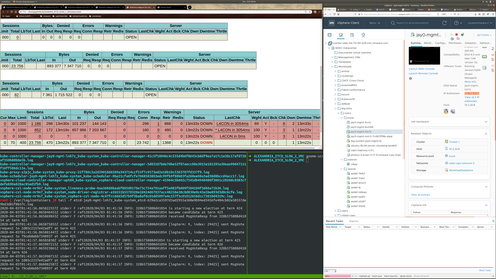
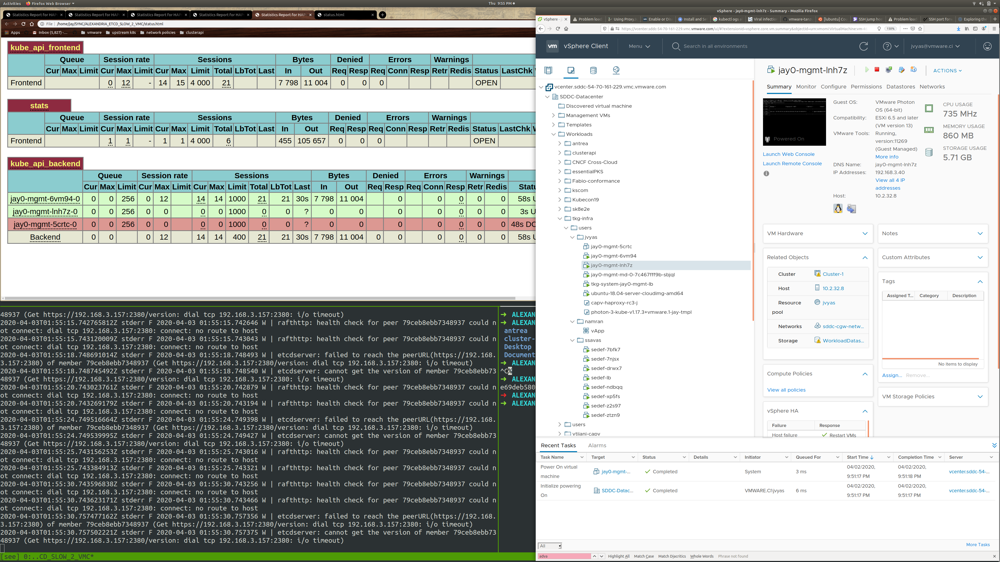
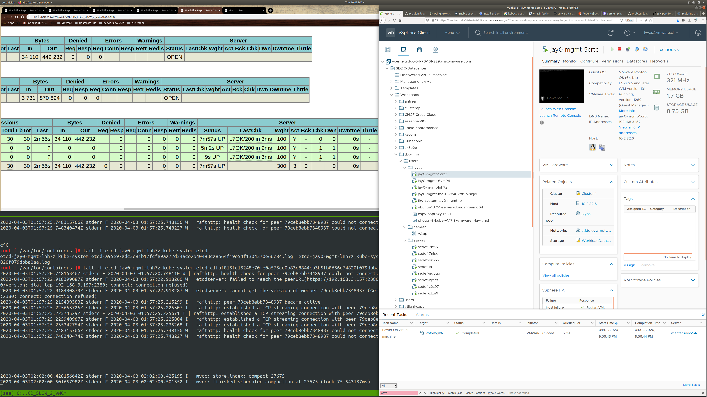

# What does a CAPV recovery scenario look like ? 

In CAPV HAProxy can be used to indicate the health of yourclusters.

Building off of what we know from how etcd operates in duress, lets consider some experiments

and see how the ClusterAPI responds... 

In a running 3 node CAPV cluster, deleting one etcd node wont cause writes to block.
But, deleting 2 nodes will !

In a running CAPV cluster, we can delete a few nodes:



After doing this we can power back on machines, until we restore 2/3 quorum:



Finally, we can manually power back on the 3rd node...



We also can just power off any node, and if there are enough nodes available for a write quorum,
CAPI will trigger turning that node back on.  When this happens, you'll see this in etcd's logs.

```
2020-04-03T02:34:21.35701956Z stderr F 2020-04-03 02:34:21.356912 W | etcdserver: cannot get the version of member 79ceb8ebb7348937 (Get https://192.168.3.157:2380/version: dial tcp 192.168.3.157:2380: connect: connection refused)
2020-04-03T02:34:23.2047401Z stderr F 2020-04-03 02:34:23.204581 I | rafthttp: peer 79ceb8ebb7348937 became active
2020-04-03T02:34:23.204787893Z stderr F 2020-04-03 02:34:23.204673 I | rafthttp: established a TCP streaming connection with peer 79ceb8ebb7348937 (stream Message reader)
2020-04-03T02:34:23.205015654Z stderr F 2020-04-03 02:34:23.204934 I | rafthttp: established a TCP streaming connection with peer 79ceb8ebb7348937 (stream MsgApp v2 reader)
```

Note that turning on and off a machine as well as deleting a machine both are recoverable in the same way for CAPI clusters.
