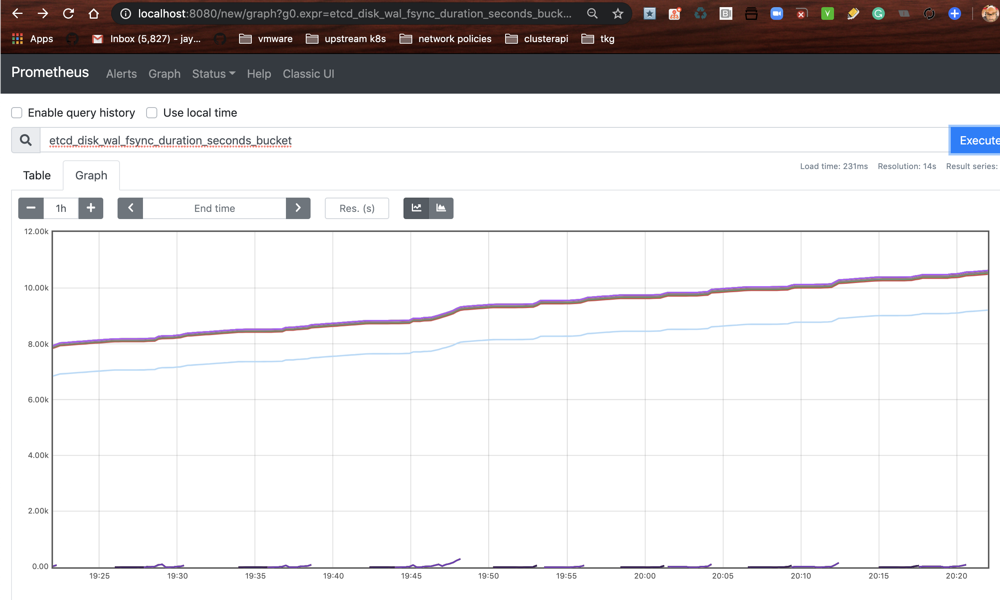
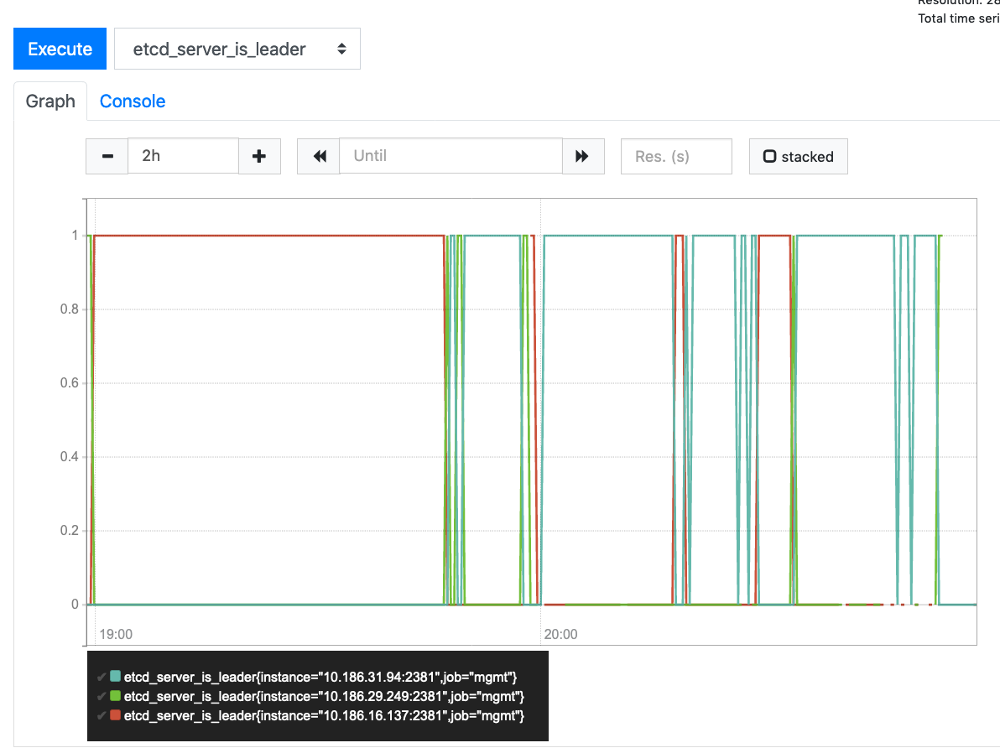
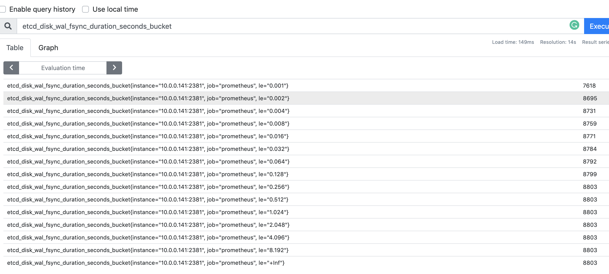

Prometheus instructions get more and more complex every day, but if you just want to monitor ETCD, this is the easiest way, no load balancers or operators or anything else required.

# Monitoring ETCD comes down to one metric: FSync

Look at its value, if it flat lines, it means that the originally fast write speed you had is slowing down, and etcd is 
not able to keep up.

In a fast etcd instance, youll likely see one many lines clustered together, all roughly moving up at the same slope.  This means that the write times are consistent.


In a cluster with slower performance of etcd, you'll see more lines, and there will be
instances where etcd is slower.  This tells you that there are many different ranges that write speeds will fall in, in terms of frequency, which can be an ominous sign of things to come... 


You'll also potentially see lots of leader elections, in cases where heartbeats are missed:



... Diving back into our faster cluster, note that the slowest write is 1/4 of a second

In general, you can compare the relative performance of etcd in different clusters by looking
at the proportion of writes which happen in lower buckets.  For example, the slow cluster (left)
below has no buckets in the .001 range, meaning that all writes happened in > .001 seconds for the
fsync calls. 

*Interpretting fsync buckets*

In general, the higher the number of writes in a lower bucket, the faster your ETCD is. 

Meanwhile, the 'fast' cluster (again, these are relative), which was running on higher quality hardware, had many writes happening in < .001 seconds (7618).  This is consitent with the fact that the faster cluster
also had a very small percentage of writes (.0001%) happening in > .032 seconds, whereas the slower cluster 

|bucket| slowetcd | fastetcd | 
|------|----------|----------|
| .001 | 0        | 7618     |      
| .002 | 0        | 8695     |  `<-- note that the faster cluster has writes which happened in < .002 s`    
| .004 | 202      | 8731     |      
| .008 | 2173     | 8759     |  
| .016 | 2552     | 8771     |       
| .032 | 2635     | 8784     |      
| .064 | 2658     | 8792     | 



...  comparitively, in a slow cluster (without SSDs, or hypervirtualized, for example) you may very early on see something like this:

```
# TYPE etcd_disk_wal_fsync_duration_seconds histogram   
etcd_disk_wal_fsync_duration_seconds_bucket{le="0.001"} 0
etcd_disk_wal_fsync_duration_seconds_bucket{le="0.002"} 0
etcd_disk_wal_fsync_duration_seconds_bucket{le="0.004"} 202
etcd_disk_wal_fsync_duration_seconds_bucket{le="0.008"} 1601
etcd_disk_wal_fsync_duration_seconds_bucket{le="0.016"} 2173
etcd_disk_wal_fsync_duration_seconds_bucket{le="0.032"} 2552                                                                 
etcd_disk_wal_fsync_duration_seconds_bucket{le="0.064"} 2635
etcd_disk_wal_fsync_duration_seconds_bucket{le="0.128"} 2658
etcd_disk_wal_fsync_duration_seconds_bucket{le="0.256"} 2669
etcd_disk_wal_fsync_duration_seconds_bucket{le="0.512"} 2674 <-- 5 writes took a half second1
etcd_disk_wal_fsync_duration_seconds_bucket{le="1.024"} 2676
etcd_disk_wal_fsync_duration_seconds_bucket{le="2.048"} 2676
etcd_disk_wal_fsync_duration_seconds_bucket{le="4.096"} 2676
etcd_disk_wal_fsync_duration_seconds_bucket{le="8.192"} 2676
etcd_disk_wal_fsync_duration_seconds_bucket{le="+Inf"} 2676
etcd_disk_wal_fsync_duration_seconds_sum 33.182538455000035
etcd_disk_wal_fsync_duration_seconds_count 2676      
```


# How to produce this sort of data 


## Requirements

- 3 node etcd cluster
- ability to edit the kubelet manifests/etcd.yaml (i.e. if starting in CAPI this is the norm)
- SSH into a bastion node that can access the 3 nodes via IP address
- Ability to run docker on the bastion

If you start out a cluster this way, then there is a chance over time that performance will degrade even more, rapidly approaching > 1 second writes. 
## run prometheus in docker
```
mkdir /var/datap ; chmod 775 /var/datap && docker run -t -i -p 9090:9090 -v /var/datap:/var/datap -v /home/ubuntu/p.yml:/etc/prometheus/prometheus.yml prom/prometheus --storage.tsdb.path=/var/datap --config.file=/etc/prometheus/prometheus.yml
```

with the following `-v` scrape target (prometheus.yml)... 


```
global:
  scrape_interval:     15s # By default, scrape targets every 15 seconds.

  # Attach these labels to any time series or alerts when communicating with
  # external systems (federation, remote storage, Alertmanager).
  external_labels:
    monitor: 'codelab-monitor'

# A scrape configuration containing exactly one endpoint to scrape:
# Here it's Prometheus itself.
scrape_configs:
  # The job name is added as a label `job=<job_name>` to any timeseries scraped from this config.
  - job_name: 'prometheus'
    # Override the global default and scrape targets from this job every 5 seconds.
    scrape_interval: 5s
    static_configs:
      - targets: ['10.0.0.217:2381']
      - targets: ['10.0.0.251:2381']
      - targets: ['10.0.0.141:2381']
```


In general you should see most prometheus writes happening within .001 s or less, like so:
## start etcd like this so you can scrape w/o credentials 

Each individual etcd node needs to get modified to listen on an insecure port like this
```
    - --listen-metrics-urls=http://10.0.0.217:2381
```

Then ssh port forward into your bastion host (which has access to the 10.... addresses)

```
ssh -L 8080:127.0.0.1:9090 ubuntu@34.221.173.93
```

And browse metrics for all etcd hosts on 

`localhost:8080`

## Testing disk speed

Tools like `dd` and `fallocate -l 1G test.img` can be used to do a quick smoke of how fast your disks are.
